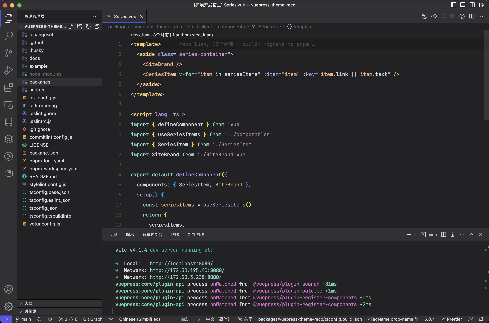

# Reco Theme for Visual Studio Code

> This Theme as much as possible according to vuepress-theme-reco.

## Screenshots

 

> Tip:  
> Icon Theme: [Moxer Icons](https://marketplace.visualstudio.com/items?itemName=Equinusocio.moxer-icons)  
> Font Family: [JetBrains Mono](https://www.jetbrains.com/lp/mono/?_gl=1*sfladt*_ga*MTIwODIwOTM5Ny4xNjU1OTk0Mjcz*_ga_9J976DJZ68*MTY2NjEwODAwNi43LjEuMTY2NjEwODAxMC41Ni4wLjA.&_ga=2.201899929.969889401.1666108006-1208209397.1655994273)

 

**Enjoy!**

**NOTE:** Thanks to anothor theme [fleet-theme](https://github.com//fleet-theme). If there is any infringement, please contact me to delete.

If you have any suggestions, create an issue on <https://github.com/recoluan/vscode-theme-reco>.
